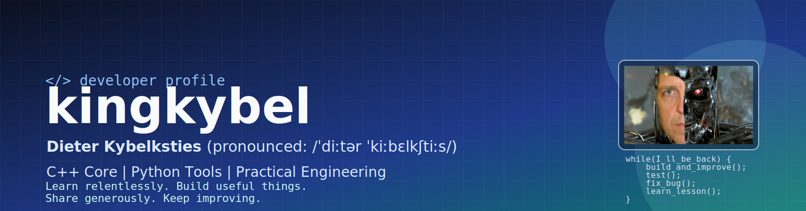
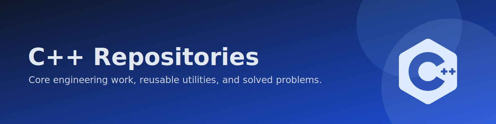
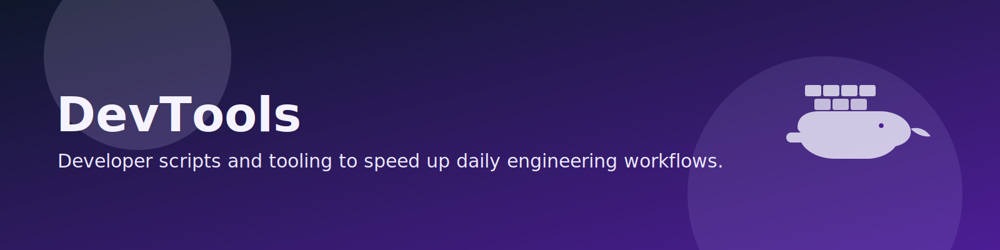
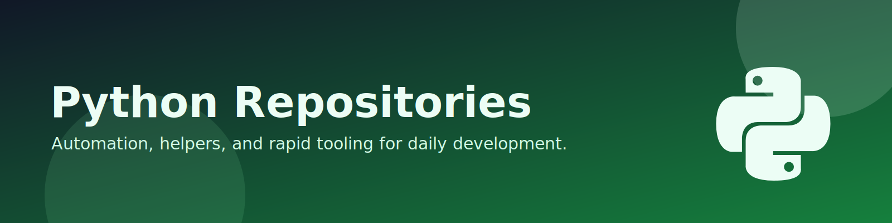
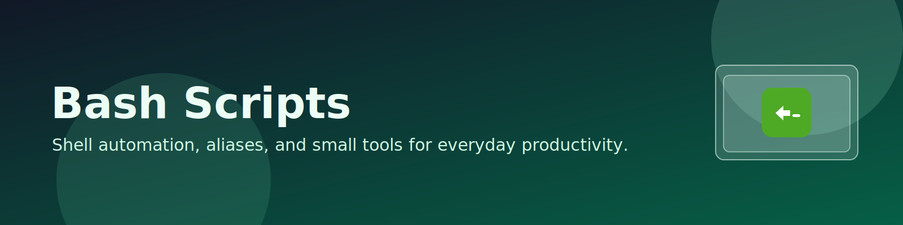

Welcome to my corner of GitHub, where practical tools, clean C++, and useful Python utilities come together.
If you like code that solves real problems without unnecessary noise, you are in the right place.

I have been fascinated by computers since I was 16 and have been programming ever since, turning a hobby into a profession.
I have worked both as a contractor and in permanent roles, and I still have fun building software and learning new techniques.

C++ is my core skill, and these repositories serve as both a mental reminder of problems I solved in the past and a showcase of my work.

- [DebugTrace](https://github.com/kingkybel/DebugTrace) - Lightweight tracing helpers to improve debugging and runtime visibility.
- [TypeTraits](https://github.com/kingkybel/TypeTraits) - Reusable type traits and templates for cleaner metaprogramming.
- [ContainerConvert](https://github.com/kingkybel/ContainerConvert) - Utilities for converting and adapting data between STL container types.
- [StringUtilities](https://github.com/kingkybel/StringUtilities) - Practical string helpers for parsing, formatting, and transformation tasks.
- [JsonObject](https://github.com/kingkybel/JsonObject) - A small library focused on creating and working with JSON objects in C++.
- [ThreadUtilities](https://github.com/kingkybel/ThreadUtilities) - Utilities that simplify common threading and concurrency patterns.
- [DirectedGraph](https://github.com/kingkybel/DirectedGraph) - Data structures and logic for working with directed graph models.
- [MessageToObject](https://github.com/kingkybel/MessageToObject) - Generates polymorphic objects from message strings for flexible parsing workflows.
- [FixDecoder](https://github.com/kingkybel/FixDecoder) - Tools for decoding and inspecting FIX messages used in trading systems.

## CMake Common

Build system consistency matters, and this repository captures reusable CMake modules and setup patterns.

- [CMakeCommon](https://github.com/kingkybel/CMakeCommon) - Shared CMake modules and conventions to standardize project setup and build behavior.

## DevTools

This section focuses on practical tooling that reduces friction in day-to-day engineering work. Dockerized local webservers that aid running an and displaying standard Linux tools like valgrind, perf, etc.

- [DevTools](https://github.com/kingkybel/DevTools) - Development helper scripts and tools to streamline repetitive workflows.
    - test coverage reports
    - heap analyses
    - ...

## Python

Python is an additional useful skill I use to aid and accelerate development.

- [PyFundamentals](https://github.com/kingkybel/PyFundamentals) - Foundational Python examples and building blocks for everyday scripting.
- [PyFlashLogger](https://github.com/kingkybel/PyFlashLogger) - A flexible logging utility aimed at quick integration and clear output.
- [Python-utilities](https://github.com/kingkybel/Python-utilities) - Handy utility scripts to speed up repetitive development and automation tasks.

## Bash Scripts

This section collects practical shell utilities and aliases that speed up repetitive terminal workflows.

- [bash-scripts](https://github.com/kingkybel/bash-scripts) - Helpful Bash scripts and aliases for day-to-day development tasks.

I like to share knowledge through tutorials and practical cheat-sheets.

- [Tutorials](https://github.com/kingkybel/Tutorials) - A growing collection of tutorials I conducted and cheat-sheets I created for quick reference.
